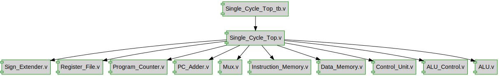

# Documentation for: project_icarus

Generated by **TerosHDL** © 2020-2021 License GPLv3 Carlos Alberto Ruiz Naranjo (carlosruiznaranjo@gmail.com) Ismael Perez Rojo (ismaelprojo@gmail.com)  Project revision 2023-06-20 01:25:05  

## Designs

- Module: [Sign_Extend ](./doc_internal/Sign_Extender.md)
- Module: [Reg_File ](./doc_internal/Register_File.md)
- Module: [PC ](./doc_internal/Program_Counter.md)
- Module: [PC_Adder ](./doc_internal/PC_Adder.md)
- Module: [Mux ](./doc_internal/Mux.md)
- Module: [Instr_Mem ](./doc_internal/Instruction_Memory.md)
- Module: [Data_Mem ](./doc_internal/Data_Memory.md)
- Module: [control_unit ](./doc_internal/Control_Unit.md)
- Module: [alu_control ](./doc_internal/ALU_Control.md)
- Module: [alu ](./doc_internal/ALU.md)
- Module: [Single_Cycle_Top ](./doc_internal/Single_Cycle_Top.md)

