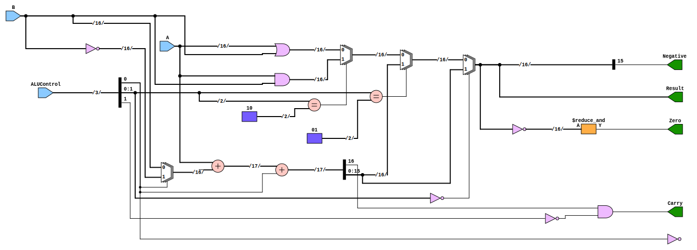

# Entity: alu 

- **File**: ALU.v
## Diagram

## Ports

| Port name  | Direction | Type   | Description |
| ---------- | --------- | ------ | ----------- |
| A          | input     | [15:0] |             |
| B          | input     | [15:0] |             |
| ALUControl | input     | [2:0]  |             |
| Result     | output    | [15:0] |             |
| Negative   | output    |        |             |
| Carry      | output    |        |             |
| Zero       | output    |        |             |
## Signals

| Name    | Type        | Description |
| ------- | ----------- | ----------- |
| a_and_b | wire [15:0] |             |
| a_or_b  | wire [15:0] |             |
| not_b   | wire [15:0] |             |
| sum     | wire [15:0] |             |
| cout    | wire        |             |
| mux_1   | wire [15:0] |             |
| mux_2   | wire [15:0] |             |

