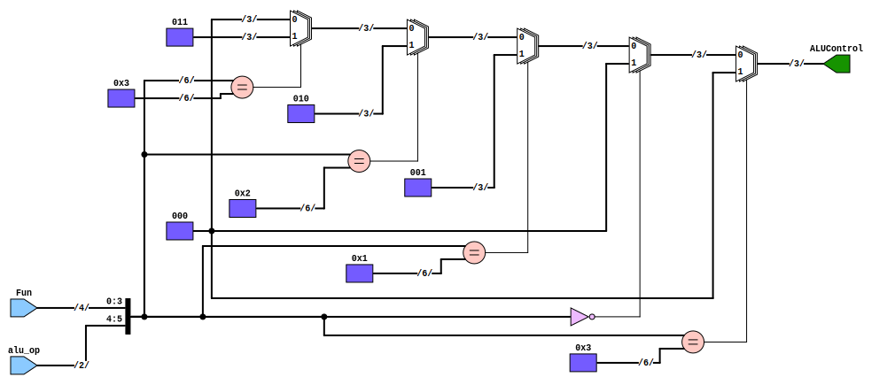

# Entity: alu_control 

- **File**: ALU_Control.v
## Diagram

## Ports

| Port name  | Direction | Type  | Description |
| ---------- | --------- | ----- | ----------- |
| alu_op     | input     | [1:0] |             |
| Fun        | input     | [3:0] |             |
| ALUControl | output    | [2:0] |             |
## Signals

| Name         | Type       | Description |
| ------------ | ---------- | ----------- |
| ALUControlIn | wire [5:0] |             |

