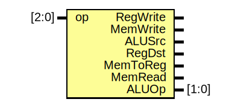
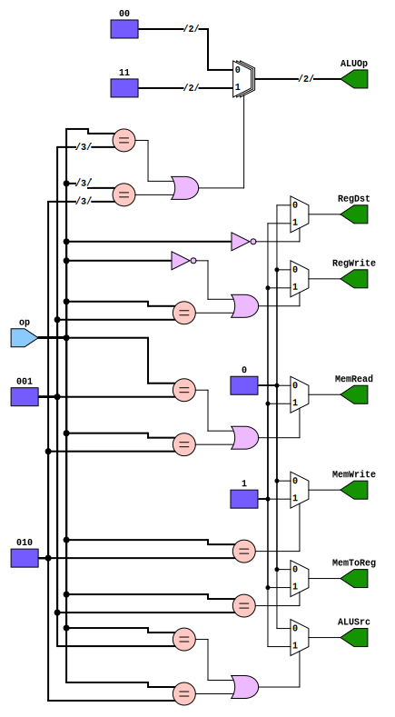

# Entity: control_unit 

- **File**: Control_Unit.v
## Diagram

## Ports

| Port name | Direction | Type  | Description |
| --------- | --------- | ----- | ----------- |
| op        | input     | [2:0] |             |
| RegWrite  | output    |       |             |
| MemWrite  | output    |       |             |
| ALUSrc    | output    |       |             |
| RegDst    | output    |       |             |
| MemToReg  | output    |       |             |
| MemRead   | output    |       |             |
| ALUOp     | output    | [1:0] |             |

