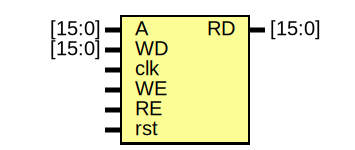

# Entity: Data_Mem 

- **File**: Data_Memory.v
## Diagram

## Ports

| Port name | Direction | Type   | Description |
| --------- | --------- | ------ | ----------- |
| A         | input     | [15:0] |             |
| WD        | input     | [15:0] |             |
| clk       | input     |        |             |
| WE        | input     |        |             |
| RE        | input     |        |             |
| rst       | input     |        |             |
| RD        | output    | [15:0] |             |
## Signals

| Name     | Type      | Description |
| -------- | --------- | ----------- |
| Data_MEM | reg[15:0] |             |
## Processes
- unnamed: ( @(posedge clk) )
  - **Type:** always
