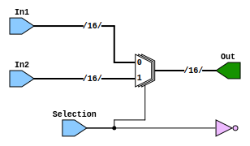

# Entity: Mux 

- **File**: Mux.v
## Diagram

## Ports

| Port name | Direction | Type   | Description |
| --------- | --------- | ------ | ----------- |
| In1       | input     | [15:0] |             |
| In2       | input     | [15:0] |             |
| Selection | input     |        |             |
| Out       | output    | [15:0] |             |

