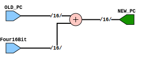

# Entity: PC_Adder 

- **File**: PC_Adder.v
## Diagram

## Ports

| Port name | Direction | Type   | Description |
| --------- | --------- | ------ | ----------- |
| OLD_PC    | input     | [15:0] |             |
| Four16Bit | input     | [15:0] |             |
| NEW_PC    | output    | [15:0] |             |

