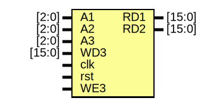

# Entity: Reg_File 

- **File**: Register_File.v
## Diagram

## Ports

| Port name | Direction | Type   | Description |
| --------- | --------- | ------ | ----------- |
| A1        | input     | [2:0]  |             |
| A2        | input     | [2:0]  |             |
| A3        | input     | [2:0]  |             |
| WD3       | input     | [15:0] |             |
| clk       | input     |        |             |
| rst       | input     |        |             |
| WE3       | input     |        |             |
| RD1       | output    | [15:0] |             |
| RD2       | output    | [15:0] |             |
## Signals

| Name      | Type      | Description |
| --------- | --------- | ----------- |
| Registers | reg[15:0] |             |
## Processes
- unnamed: ( @(posedge clk) )
  - **Type:** always
