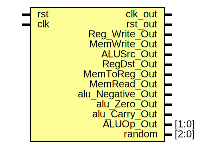

# Entity: Single_Cycle_Top 

- **File**: Single_Cycle_Top.v
## Diagram

## Ports

| Port name        | Direction | Type  | Description |
| ---------------- | --------- | ----- | ----------- |
| rst              | input     |       |             |
| clk              | input     |       |             |
| clk_out          | output    |       |             |
| rst_out          | output    |       |             |
| Reg_Write_Out    | output    |       |             |
| MemWrite_Out     | output    |       |             |
| ALUSrc_Out       | output    |       |             |
| RegDst_Out       | output    |       |             |
| MemToReg_Out     | output    |       |             |
| MemRead_Out      | output    |       |             |
| alu_Negative_Out | output    |       |             |
| alu_Zero_Out     | output    |       |             |
| alu_Carry_Out    | output    |       |             |
| ALUOp_Out        | output    | [1:0] |             |
| random           | output    | [2:0] |             |
## Signals

| Name                                               | Type        | Description |
| -------------------------------------------------- | ----------- | ----------- |
| PC_Top                                             | wire [15:0] |             |
| RD_Instr                                           | wire [15:0] |             |
| RD1_Top                                            | wire [15:0] |             |
| RD2_Top                                            | wire [15:0] |             |
| SignExt_Top                                        | wire [15:0] |             |
| ALU_RESULT                                         | wire [15:0] |             |
| RegWrite                                           | wire        |             |
| MemWrite                                           | wire        |             |
| ALUSrc                                             | wire        |             |
| RegDst                                             | wire        |             |
| MemToReg                                           | wire        |             |
| MemRead                                            | wire        |             |
| ALUOp                                              | wire [1:0]  |             |
| ALUControl_Top                                     | wire [2:0]  |             |
| ReadData                                           | wire [15:0] |             |
| NEW_PC                                             | wire [15:0] |             |
| Mux_Register_To_ALU_Result                         | wire [15:0] |             |
| Mux_Data_Memory_To_Register_File_Write_Back_Result | wire [15:0] |             |
## Instantiations

- PC: PC
- PC_Adder: PC_Adder
- Instruction_Memory: Instr_Mem
- Control_Unit: control_unit
- ALU_Control: alu_control
- Register_File: Reg_File
- Sign_Extend: Sign_Extend
- Mux_Register_To_ALU: Mux
- ALU: alu
- Data_Memory: Data_Mem
- Mux_Data_Memory_To_Register_File_Write_Back: Mux
